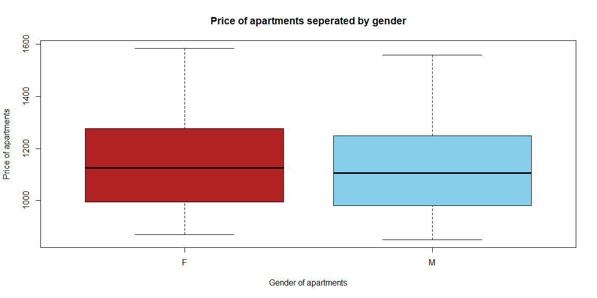

**Week 1 Analysis**


```r
# This gray area is called an "R-chunk". 
# These library commands install some powerful functions for your use later on.
library(mosaic)
library(pander)
library(tidyverse)
library(DT) 

# This read_csv command reads in the "Rent" data set into an object called "Rent"
Rent <- read_csv("~/Data Analyticts/Portfolio/Portfolio/raw_data/Rent.csv")

# To load this data set into your R-Console do the following:
#  1. From your top file menu select "Session -> Set Working Directory -> To Source File Location"
#  2. Press the green "play button" in the top right corner of this gray box (which is called an "R-chunk").
#  3. Then in your "Console" window of 
```

<br />

## Background

Here is a data table showing the available approved housing apartment options at BYU-Idaho for single students. There are 122 entries comprising 57 female and 65 male apartment options.


```r
# Code to get you started. 
# View(...) works great in the Console, but datatable(...) must be
# used instead within an R-chunk.
datatable(Rent, options=list(lengthMenu = c(3,10,30)), extensions="Responsive")
```

```{=html}
<div class="datatables html-widget html-fill-item-overflow-hidden html-fill-item" id="htmlwidget-156f9bf992b54fc082cf" style="width:100%;height:auto;"></div>
<script type="application/json" data-for="htmlwidget-156f9bf992b54fc082cf">{"x":{"filter":"none","vertical":false,"extensions":["Responsive"],"data":[["1","2","3","4","5","6","7","8","9","10","11","12","13","14","15","16","17","18","19","20","21","22","23","24","25","26","27","28","29","30","31","32","33","34","35","36","37","38","39","40","41","42","43","44","45","46","47","48","49","50","51","52","53","54","55","56","57","58","59","60","61","62","63","64","65","66","67","68","69","70","71","72","73","74","75","76","77","78","79","80","81","82","83","84","85","86","87","88","89","90","91","92","93","94","95","96","97","98","99","100","101","102","103","104","105","106","107","108","109","110","111","112","113","114","115","116","117","118","119","120","121","122"],["ABBY LANE MANOR","ABODE DUPLEX","ABRI APARTMENTS - MEN","ABRI APARTMENTS - WOMEN","ALBION APARTMENT","ALEXANDER APARTMENT","ALLDREDGE HOUSE","ALLEN RIDGE APARTMENTS","ALLEN'S SUNRISE VILLAGE - MEN","ALLEN'S SUNRISE VILLAGE - WOMEN","ALPINE CHALET","ALTA VIEW APARTMENTS","AMERICAN AVENUE - MEN","AMERICAN AVENUE - WOMEN","ARBOR COVE","ARCADIA APARTMENTS","ARPAD","ASPEN VILLAGE - MEN","ASPEN VILLAGE - WOMEN","AT THE GROVE","AUTUMN WINDS","AVONLEA APARTMENTS","BAYSIDE MANOR","BIRCH PLAZA","BIRCH WOOD I","BIRCH WOOD II","BLUE DOOR, THE","BOUNTIFUL PLACE","BRIARWOOD APARTMENTS","BRIGHAM'S MILL","BRIGHTON APARTMENTS-MEN","BRIGHTON APARTMENTS-WOMEN","BROOKLYN APARTMENTS","BROOKSIDE VILLAGE - MEN","BROOKSIDE VILLAGE - WOMEN","BUENA VISTA","BUNKHOUSE","CAMDEN APARTMENTS-MEN","CAMDEN APARTMENTS-WOMEN","CAMPUS VIEW APARTMENTS","CARRIAGE HOUSE","CEDARS, THE-MEN","CEDARS, THE-WOMEN","CENTRE SQUARE-MEN","CENTRE SQUARE-WOMEN","CHAPMAN HOUSE","CLARKE APARTMENTS","COLLEGE AVENUE APARTMENTS","COLONIAL HEIGHTS TOWNHOUSE","COLONIAL HOUSE","CONDIE COTTAGE","COTTONWOOD-MEN","COTTONWOOD-WOMEN","CREEKSIDE COTTAGES - WOMEN","CREEKSIDE COTTAGES-MEN","CRESTWOOD APARTMENTS","CRESTWOOD COTTAGE","CRESTWOOD HOUSE","DANBURY MANOR","DAVENPORT APARTMENTS","DELTA PHI APARTMENTS","GATES, THE - MEN","GATES, THE - WOMEN","GEORGETOWN APARTMENTS","GREENBRIER NORTH","GREENBRIER SOUTH","HARRIS HALL","HEMMING HOUSE I","HEMMING HOUSE III","HEMMING HOUSE IV","HERITAGE MEN","HERITAGE WOMEN","HILLCREST TOWNHOUSES","HILL'S COLLEGE AVE APTS","IVY, THE - Men","IVY, THE - Women","JACOB'S HOUSE","JORDAN RIDGE","KENSINGTON MANOR - MEN","KENSINGTON MANOR - WOMEN","LA JOLLA - MEN","LA JOLLA - WOMEN","LEGACY RIDGE","MOUNTAIN CREST","MOUNTAIN LOFTS - MEN","MOUNTAIN LOFTS - WOMEN","NAUVOO HOUSE I","NAUVOO HOUSE II","NORMANDY APARTMENTS","NORTHPOINT - MEN","NORTHPOINT - WOMEN","PARK VIEW APTS - WOMEN","PARK VIEW APTS-MEN","PINCOCK HOUSE","PINES NORTH, THE","PINES SOUTH, THE","PINNACLE POINT","QUINCY HOUSE","RED BRICK HOUSE","RED DOOR, THE","RIVIERA APARTMENTS","ROCKLAND APARTMENTS","ROOST, THE - MEN","ROOST, THE - WOMEN","ROYAL CREST","SHADETREE APARTMENT","SHELBOURNE APARTMENTS","SNOWED INN, THE","SNOWVIEW APARTMENTS","SOMERSET APARTMENTS - MEN","SOMERSET APARTMENTS - WOMEN","SPORI VILLA","SUNSET HALL","TOWERS I","TOWERS II","TUSCANY PLACE - MEN","TUSCANY PLACE - WOMEN","WEBSTER HOUSE","WEST WINDS","WHITFIELD HOUSE","WINDSOR MANOR-MEN","WINDSOR MANOR-WOMEN"],["F","M","M","F","F","F","F","M","M","F","M","M","M","F","M","M","M","M","F","F","F","F","F","F","F","F","M","M","M","M","M","F","F","M","F","F","M","M","F","M","F","M","F","M","F","M","M","F","M","F","F","M","F","F","M","M","F","M","M","F","M","M","F","M","M","F","M","F","M","M","M","F","F","F","M","F","M","M","M","F","M","F","F","M","M","F","M","F","F","M","F","F","M","M","M","M","M","M","F","M","F","M","M","F","F","F","M","M","F","M","F","M","F","M","F","M","F","F","M","M","M","F"],["437 S 4TH W","224 E 2ND S","220 E 1ST S","220 E 1ST S","231 W 2ND S","276 W 3RD S","243 S 1ST E","57 S CENTER ST","48 W 2ND S","48 W 2ND S","460 S 2ND W","346 W 2ND S","151 S 1ST E","151 S 1ST E","220 S 2ND W","138 VIKING DR","271 S 2ND W","545 S 2ND E","545 S 2ND E","349 HARVARD AVE","160 W 5TH S","175 W 3RD S","248 1/2 CORNELL AVE","236 S 1ST W","253 S 2ND W","253 S 2ND W","123 PRINCETON CT","345 W 5TH S","163 E 2ND S","431 S 3RD W","242 W 6TH S","242 W 6TH S","345 S 2ND W","487 S 3RD W","487 S 3RD W","406 S 3RD E","156 W 4th S","225 W 5TH S","225 W 5TH S","136 W 3RD S","246 S 1ST W","120 W 2ND S","226 S 1st W","650 S 1ST W","650 S 1ST W","179 E 2ND S","156 S CENTER ST","150 COLLEGE AVE","251 E 4TH S","151 W 4TH S","267 W 3RD S","42 S 1ST W","42 S 1ST W","276 STEINER AVE","336 W 3RD S","235 S 1ST E","221 S 1ST E","235 S 1ST E","156 E 2ND S","145 W 3RD S","139 VIKING DR","370 W 7TH S","350 W 7TH S","236 W 3RD S","129 PRINCETON CT","129 PRINCETON CT","364 S 1ST W","133 W 1ST S","124 W 1ST S","113 W 1ST S","129 W 4TH S","129 W 4TH S","465 S 2ND E","136 COLLEGE AVE","649 S 2ND W","649 S 2ND W","149 E 2ND S","291 E 7TH S","345 S 2ND E","345 S 2ND E","65 S 1ST W","65 S 1ST W","667 S 2ND E","132 S 3rd W","538 S 2ND W","538 S 2ND W","175 W 5TH S","175 W 5TH S","114 W 3RD S","141 S 1ST W","141 S 1ST W","154 S 3RD W","154 S 3RD W","163 E 2ND S","140 W 2ND S","140 W 2ND S","51 S 1ST E","264 S 2ND W","128 W 3RD S","135 S 1ST E","277 S 1ST E","235 W 4TH S","486 S 3RD W","486 S 3RD W","340 S 1ST W","60 W 1ST S","570 S 2ND W","271 W 2ND S","12 W. 2nd S.","480 S 1ST W","480 S 1ST W","174 COLLEGE AVE","150 W 3RD S","333 W 6TH S","335 W 5TH S","440 S 2ND W","440 S 2ND W","268 S 1ST W","160 W 5TH S","175 E 2ND S","125 E 2ND S","125 E 2ND S"],["(208) 359-3687","(912) 399-1107","2084177223","(208) 417-7223","(801) 856-0732","208-995-8543","208-206-4697","(801) 864-1708","356-3995","208-356-3995","(208) 356-9282","208-360-0097","2083565097","(208) 356-5097","(208) 356-8988","208-881-2935","208-881-5026","208-356-7701","(208) 356-7701","801-319-4334","(208) 356-0821","(208) 359-0920","7202574493","(208) 359-8200","(208) 359-8200","(208) 359-8200","(208) 240-2261","(208) 351-7080","356-3001","208-538-9058","208-356-9693","208-356-9693","208-356-9500","(208) 356-0788","(208) 356-0788","208-359-9681","208-356-7419","208-656-9611","208-656-9611","359-0920","208-356-4361","208-356-0222","208-346-7006","208-496-9220","208-496-9220","3563001","(208) 356-6660","208-313-8182","356-6752","208-359-2848","(208) 557-1520","208-356-9576","(208) 356-9576","(503) 515-8377","503-515-8377","208-356-5149","208-356-5149","208-356-5149","208-356-8921","208-356-3216","208-359-8015","208-356-6686","208-356-6686","359-3191","356-3001","356-3001","208-359-5141","208-356-6142","356-6142","208-356-6142","208-356-7952","208-356-7952","356-7211","208-356-5786 or","208-356-6556","(208) 356-6556","208-356-3001","208-359-2221","208.356.4473","208.356.4473","(208) 359-1985","(208) 359-1985","359-2211","(208) 359-4193","208-356-5638","208-356-5638","356-7756","356-7756","208-356-7234","208-681-9542","208-681-9542","356-3697","208 356-3697","2083563001","208-356-5605","208-356-5605","208-360-2845","208-356-7568","356-4361","208-201-3466","3604043","(208) 356-0923","208-881-6249","208-881-6249","208-356-7778","208-709-1608","208-656-0746","562-572-2943","(208) 359-5517","(208) 356-7699","(208) 356-7699","(208) 351-8072","356-4361","208-359-5965","208-390-3706","(208) 356-3480","(208) 356-3480","356-4361","(208) 356-0821","2083563001","208-356-6789","208-356-6789"],[1035,980,1420,1445,1062.5,972.5,1045,890,1000,1000,999,895,1202.5,1050,1018.333333,995,1150,1100,900,null,1345,1222,960,980,1019,1275,925,1200,998,1325,1225,1300,870,1310,1310,925,961.666666,1250,1216.666666,988,1075,1345,1495,1349,1349,1198,995,995,850,1245,1120,955,950,1261.666666,1245,940,940,925,null,895,995,1375,1375,995,981,981,1020,1120,975,1010,1189,1259,1125,880,1267.5,1267.5,1120,1374,1095,1224,1189,1129,1374,950,1323,1388,1279,1279,995,1537.333333,1537.333333,1050,1133.333333,1276,null,975,1046.25,900,1126,972.5,null,896.666666,1175,1175,995,915,1155,1150,1125,1110,1110,895,967,1300,1400,null,1302.5,1125,1410,1198,1560,1585],[1060,980,1445,1495,1150,1115,1095,890,1075,1075,999,895,1380,1075,1045,995,1225,1200,1000,null,1345,1369,960,980,1019,1390,925,1250,998,1325,1275,1325,895,1310,1310,925,995,1250,1250,988,1075,1345,1495,1399,1399,1276,995,995,850,1245,1120,960,950,1395,1295,940,940,925,null,895,1045,1425,1425,995,981,981,1045,1150,1000,1010,1189,1259,1245,880,1330,1330,1120,1399,1095,1249,1189,1129,1399,950,1356,1557,1279,1279,995,1669,1669,1100,1200,1276,null,995,1135,900,1227,995,null,960,1200,1200,995,950,1240,1150,1200,1110,1110,895,967,1300,1450,null,1315,1215,1410,1276,1585,1585],[42,6,138,150,5,22,8,17,138,144,252,26,59,165,97,41,67,144,210,6,96,60,8,343,65,24,48,148,24,180,108,60,144,60,86,21,324,24,53,32,234,360,444,304,546,7,42,9,64,342,6,60,84,24,11,50,10,11,19,71,60,288,324,72,48,92,44,9,7,8,180,192,140,11,264,636,11,360,108,108,72,234,288,42,474,590,288,338,40,476,548,32,29,7,144,200,140,29,5,53,100,238,59,114,342,6,168,8,64,108,180,10,14,168,248,142,142,9,24,7,136,208],[38,3,216,216,4,18,8,9,133,133,111,30,0,0,60,30,27,80,84,5,96,54,8,160,160,160,25,84,50,0,102,60,0,96,96,7,100,65,65,19,85,300,230,100,200,50,42,10,54,241,5,100,100,28,10,10,10,10,0,30,44,0,0,51,40,70,28,6,7,0,0,145,60,3,50,100,50,350,103,103,200,200,288,42,0,0,300,300,20,508,508,0,0,50,0,300,84,20,5,25,0,0,35,35,0,0,128,0,35,70,80,0,0,168,248,0,0,14,96,50,66,100],[100,100,150,150,100,100,150,100,100,100,75,80,100,100,75,100,150,75,75,0,75,150,90,75,75,75,100,75,125,100,150,150,75,75,75,75,75,75,75,125,125,100,100,75,75,125,100,100,100,85,100,75,75,100,100,75,75,75,0,0,75,100,100,75,125,125,75,100,100,100,150,150,100,70,100,100,125,150,100,100,150,150,150,110,100,100,0,0,75,100,100,0,150,125,0,100,75,50,125,100,0,75,75,75,75,0,100,200,100,75,75,150,125,75,75,125,125,125,75,125,75,75],[0,0,0,0,0,0,0,0,0,0,0,0,0,0,0,0,0,0,0,0,0,0,0,0,0,0,0,0,0,0,0,0,0,0,0,0,0,0,0,0,0,0,0,0,0,0,0,0,50,0,0,0,0,0,0,0,0,0,0,0,0,0,0,0,0,0,0,0,0,0,0,0,0,0,0,0,0,0,0,0,0,0,0,0,0,0,0,0,0,0,0,0,0,0,0,0,0,0,0,0,0,0,0,0,0,175,0,0,0,0,0,0,0,0,0,0,0,0,0,0,0,0],[3,1,3,3,3,10,3,1,3,3,1,19,3,6,6,6,6,20,10,1,1,3,1,1,1,3,1,3,1,1,10,3,3,1,3,6,6,2,6,1,1,1,1,6,12,3,6,1,1,1,1,3,1,6,3,3,3,3,10,3,3,3,3,1,1,1,3,3,3,1,1,1,3,1,3,3,1,3,1,3,1,1,3,1,10,21,1,1,3,36,34,10,10,1,6,3,10,10,3,3,3,12,10,10,3,3,10,1,3,1,1,1,3,3,3,3,3,6,1,3,6,8],["www.abbylaneapartments.com","sites.google.com/site/robertspencerbrown/abodehouse","www.liveabri.com","www.liveabri.com",null,"www.alexanderapartments.wordpress.com",null,"allenridge.blogspot.com","www.sunrisevillageapts.com","www.sunrisevillageapts.com","www.rexburghousing.com","www.altaviewapts.com","myamericanavenue.com","myamericanavenue.com",null,"www.arcadiarexburg.com","www.arpadhousing.com","www.aspenvillageapartments.com","www.aspenvillageapartments.com","https://www.facebook.com/atthegroveapts/","www.rexburghousing.com","www.bestnesthousing.com/avonlea.php","baysidemanor.blogspot.com","www.rexburghousing.com","www.rexburghousing.com","www.rexburghousing.com","bluedoorapts.com","www.bountifulplace.com","www.bestnesthousing.com","www.brighamsmill.com","www.brighton-apartments.net","www.brighton-apartments.net","WWW.BROOKLYNAPTS.NET","www.rexburghousing.com","www.rexburghousing.com","buenavistarexburg.blogspot.com","www.bunkhouseapts.com","www.camdenapts.net","www.camdenapts.net","www.bestnesthousing.com/campus-view.php","www.bestnesthousing.com/carriage-house.php","Cedarshousing.com","Cedarshousing.com","www.byui.edu/housing/centre-square","www.byui.edu/housing/centre-square","www.bestnesthousing.com/chapman-house.php","clarkeapartments.com",null,"WWW.COLONIALHEIGHTSTOWNHOUSES.COM","www.colonial-house.com","condiecottage.weebly.com","www.cottonwoodstudentapartments.com","www.cottonwoodstudentapartments.com","creeksidewomenbyui.blogspot.com","creeksidemensbyui.blogspot.com","www.crestwoodapt.com","www.crestwoodapt.com","www.crestwoodapt.com","www.danburymanor.com","davenportapartments.net","www.deltaphiapts.com","www.thegatesatrexburg.com","www.thegatesatrexburg.com","www.rexburghousing.com","www.bestnesthousing.com","www.bestnesthousing.com","harrishallapartments.com","www.hemminghousing.com","www.hemminghousing.com","www.hemminghousing.com","HeritageRexburg.com","HeritageRexburg.com","hillcrestinrexburg.com",null,"theivyapartments.com","theivyapartments.com","www.bestnesthousing.com","www.meet-me-at-the-ridge.com","www.kensingtonmanorrexburg.com","www.kensingtonmanorrexburg.com","www.LaJollaRexburg.com","www.LaJollaRexburg.com","www.meet-me-at-the-ridge.com","www.mntcrestapts.com","www.mountainloftsatrexburg.com","www.mountainloftsatrexburg.com","WWW.NAUVOOHOUSE.COM","WWW.NAUVOOHOUSE.COM","www.normandystudentapartments.com","www.NorthPointRexburg.com","www.NorthPointRexburg.com","www.parkviewrexburg.com","www.parkviewrexburg.com","www.bestnesthousing.com/pincock-house.php","pineshousing.com","pineshousing.com","rexburgpinnacle.com","www.quincyhouserexburgmenshousing.blogspot.com","www.bestnesthousing.com/red-brick-house.php","reddoorapts.com","WWW.RIVIERA-APTS.COM","www.rexburgHousing.com","rexburgroost.com","rexburgroost.com","WWW.ROYALCRESTAPARTMENTS.COM",null,"www.shelbourneapts.com","www.thesnowedinn.blogspot.com","www.snowviewapts.com","www.rexburghousing.com","www.rexburghousing.com",null,"www.bestnesthousing.com/sunset-hall.php","thetowersrexburg.com","thetowerstwo.com","Tuscanyplace.net","Tuscanyplace.net","www.bestnesthousing.com/webster-house.php","www.rexburghousing.com","www.bestnesthousing.com/whitfield-house.php","www.windsormanor.net","www.windsormanor.net"],[43.8169418,43.8218153,43.8239342,43.8239342,43.8218385,43.8197811,43.82073,43.824663,43.821866,43.82186,43.8165761,43.8218751,43.822203,43.8228628,43.8214093,43.8177393,43.820138,43.8146367,43.814649,43.8185731,43.8156171,43.8197584,43.8203851,43.8209717,43.8209717,43.820673,43.823664,43.815652,43.82186,43.817458,43.8133921,43.8133921,43.8188718,43.8161353,43.8161353,43.8175075,43.8187344,43.8156024,43.8156024,43.820143,43.8207848,43.8218672,43.8211586,43.812247,43.811831,43.822054,43.8225813,43.8226754,43.8176752,43.8176902,43.819536,43.8250778,43.8250778,43.8197851,43.8197851,43.8209405,43.8213116,43.8209405,43.8218191,43.819765,43.8177035,43.8116909,43.81355,43.819781,43.823056,43.823056,43.8185058,43.823583,43.8239553,43.8239263,43.817232,43.8177064,43.8163212,43.822994,43.812377,43.812377,43.822228,43.8120309,43.8187924,43.8187924,43.8246842,43.8246842,43.812168,43.8230786,43.815,43.815,43.8155931,43.8155931,43.8197996,43.822758,43.822758,43.8222826,43.8222826,43.822094,43.8218723,43.8218723,43.824505,43.8204947,43.8197965,43.8285259,43.8200969,43.8176975,43.815739,43.815739,43.8191657,43.823957,43.814119,43.8218453,43.821957,43.8163422,43.8163422,43.822269,43.820059,43.813151,null,43.8170624,43.8170624,43.820268,43.8156171,43.822083,43.81351,43.822092],[-111.7952062,-111.7771495,-111.7773062,-111.7773062,-111.7906463,-111.7918951,-111.780478,-111.7835934,-111.7852097,-111.785197,-111.7895659,-111.7938578,-111.780098,-111.7807632,-111.7895566,-111.7886609,-111.788876,-111.7780764,-111.778083,-111.7766137,-111.7884885,-111.788829,-111.7795297,-111.7867163,-111.7867163,-111.7895151,-111.779473,-111.792396,-111.779097,-111.792466,-111.7945301,-111.7945301,-111.7895166,-111.7924099,-111.7924099,-111.7752093,-111.7867224,-111.7917058,-111.7917058,-111.78777,-111.7867195,-111.7872458,-111.7867132,-111.787101,-111.787004,-111.778304,-111.7838412,-111.7824172,-111.7764603,-111.788803,-111.791806,-111.7867042,-111.7867042,-111.7943981,-111.7943981,-111.7809226,-111.7809272,-111.7809226,-111.7791712,-111.7879773,-111.7886615,-111.794504,-111.791355,-111.7907129,-111.779371,-111.779371,-111.7867268,-111.787926,-111.7875196,-111.7871752,-111.787433,-111.7881413,-111.7780659,-111.782747,-111.789553,-111.789553,-111.779221,-111.7758519,-111.7780591,-111.7780591,-111.7866669,-111.7866669,-111.778051,-111.7924581,-111.791299,-111.791299,-111.7888627,-111.7888627,-111.7871315,-111.78617,-111.78617,-111.7924522,-111.7924522,-111.778896,-111.7878656,-111.7878656,-111.780339,-111.7895635,-111.7875345,-111.779619,-111.7809297,-111.7906892,-111.792608,-111.792608,-111.7869267,-111.7855467,-111.789569,-111.7917922,-111.784145,-111.7869059,-111.7869059,-111.782776,-111.788248,-111.792518,null,-111.7895741,-111.7895741,-111.7868774,-111.7884885,-111.778657,-111.786668,-111.78069],[0.745647284,0.186411821,0.310686368,0.310686368,0.186411821,0.434960916,0.186411821,0.310686368,0.062137274,0.062137274,0.434960916,0.372823642,0.248549095,0.372823642,0.186411821,0.372823642,0.248549095,0.372823642,0.372823642,0.186411821,0.434960916,0.248549095,0.124274547,0.062137274,0.062137274,0.248549095,0.372823642,0.497098189,0.186411821,0.621372737,0.434960916,0.434960916,0.372823642,0.559235463,0.559235463,0.310686368,0.248549095,0.497098189,0.497098189,0.186411821,0.062137274,0.35418246,0.553021736,0.497098189,0.366609915,0.186411821,0.186411821,0.248549095,0.248549095,0.372823642,0.434960916,0.248549095,0.248549095,0.559235463,0.559235463,0.248549095,0.248549095,0.248549095,0.186411821,0.186411821,0.372823642,0.310686368,0.310686368,0.372823642,0.434960916,0.434960916,0.248549095,0.186411821,0.186411821,0.186411821,0.310686368,0.372823642,0.248549095,0.310686368,0.124274547,0.124274547,0.186411821,0.434960916,0.062137274,0.062137274,0.186411821,0.186411821,0.248549095,0.372823642,0.434960916,0.434960916,0.372823642,0.372823642,0.186411821,0.062137274,0.062137274,0.310686368,0.310686368,0.186411821,0.062137274,0.062137274,0.434960916,0.248549095,0.186411821,0.68351001,0.186411821,0.497098189,0.497098189,0.497098189,0.186411821,0.186411821,0.248549095,0.248549095,0.124274547,0.372823642,0.372823642,0.248549095,0.248549095,0.372823642,null,0.497098189,0.497098189,0.124274547,0.434960916,0.186411821,0.186411821,0.310686368],[16,4,8,8,4,8,5,6,1,1,10,7,6,7,4,8,5,6,6,3,9,5,3,1,1,5,9,12,5,12,10,10,7,12,12,6,4,11,11,4,2,1,1,10,1,4,4,5,4,8,8,5,5,11,11,5,6,5,5,4,8,8,7,7,9,9,5,4,4,3,6,7,4,6,3,3,5,8,1,1,4,4,6,8,9,9,9,9,3,1,1,7,7,4,1,1,9,5,4,15,4,10,12,12,4,4,6,5,2,7,7,5,4,8,null,9,9,2,9,4,4,6],["We are a small women's complex offering private rooms and quaint living.  Many students enjoy our advantages enough that they stay with us until graduation.  We are sure you would like staying with us!  We offer free parking, off-track storage and wireless internet- NOW with cheaper rent prices!","This cozy little apartment is located only one block from campus. There are a lot of freebies for the price. All utilities are included, there is a free-to-use, in-apartment washer and dryer, free WiFi, and free covered parking. When you sign for two semesters at a time, you receive a $100 discount. Join us now for a great \"small complex\" feel!","24 hour special $100 off! Look no further than the Abri, Rexburg's newest student housing community. Currently leasing women's spots for fall '17, &amp; men's for winter '18. From upscale, modern finishes, to our state-of-the-art fitness center, to our courtyard with firepit, Abri is the place to be! We offer both standard &amp; townhome style residences.","$100 OFF SPECIAL! Look no further than the Abri, Rexburg's newest student housing community. Currently leasing women's spots for fall '17, &amp; men's for winter '18. From upscale, modern finishes, to our state-of-the-art fitness center, to our courtyard with firepit, Abri is the place to be! We offer both standard &amp; townhome style residences.","Cute, newly painted basement apartment across the street from Porter Park and 1.5 blocks from the Hart building. Utilities and Internet are free. Washer and Dryer included in the Apartment. There are a total of 3 bedrooms;1 private room and 2 shared rooms. The apartment is shared by 5 girls. Call soon, our rooms go fast. Thank you for your interest. \n","We are also signing for Fall and Winter 2017. Get $25 off per semester for signing 2 consecutive semesters. No application fee or parking fee and get $40 in quarters for laundry each semester.","Hurry quick! Come make ALLDREDGE HOUSE your home away from home! Located directly across the street from the Clarke and Kirkham Buildings and only a few blocks away from down town. Great ward with the guys right next door!","The best kept housing secret at BYU-Idaho. Small complex (only 17 tenants), but large living areas and rooms.  Private, but in the best location in town - central to campus, shopping, and great activities.  Best of all, a great ward!","Allen's Sunrise Village offers housing for both men and women! We are well-known for our friendliness,low prices,great location,fantastically reliable OPTIX internet,friendly residents and amazing managers. You'll love being in the same ward as the Sunrise Village women!  We would love to have you come and live with us and find out why everyone loves Sunrise Village. www.SunriseVillageApts.com","We offer housing for both men and women! We are well-known for our friendliness, new modern remodel, low prices, great location, our fantastically reliable OPTIX internet and amazing managers. You'll love having all Sunrise residents in your ward!  Now offering Unlimited Laundry each semester for $25!  We would love to have live with us and find out why everyone loves to live at Sunrise Village.","Alpine Chalet is a great place to live!  It is close to campus and surrounded by many BYUI housing complexes.  It has an amazing pool, hot tub, and weight room. Not to mention, we added 2nd fridges and smart TVs to all of our apartments! There is an outdoor gas fire pit and built-in barbecue area that is great for hanging out with friends or studying.","Make Alta View your home next semester. Alta View Apartments is BYUI mens approved housing. Newly remodeled, comfortable, affordable housing. Free satellite television, Optix high-speed internet, great ward, on-site laundry, tons of parking, and located next to Porter Park. Earn $25 for each signed referral. Call us today at 208-360-0097 for questions or to schedule a tour!","American Avenue, BYU Idaho Approved Men and Women's housing, is less than a 1/2 block from campus. We have ample parking, onsite FREE laundry, Fiber Optix high speed internet, 32\" flat screen SONY TV's, heated wood floors, and various layouts. We would love for you to come take a tour!\n\nBring a friend and get $100 per friend you bring that signs. Unlimited friend credits!","American Avenue, BYU Idaho Approved Men and Women's housing, is less than a 1/2 block from campus. We have ample parking, FREE onsite laundry, Fiber Optix highspeed internet, 32\" flat screen SONY TV's, heated wood floors, and various layouts. We would love for you to come take a tour!\n\nBring a friend and get $100 per friend that you bring. Unlimited friend credits!","Arbor Cove is truly a one of a kind community. Each apartment has a unique layout with options for large bedrooms, private bathrooms, and large spacious living areas. We are one block from campus, right next to Porter Park, and within walking distance to the grocery store. You can also spend time in our field playing volleyball, soccer, or having a BBQ with your friends!","Arcadia Apartments is located just across from the BYU Idaho Center, literally steps from campus. Arcadia is priced at just $1045 for the semester. Arcadia offers clean, comfortable apartments and a very social atmosphere.  Awesome amenities include World Gym Membership, Sand Volleyball, Basketball Court, Apple Tv, and so much more.  Call/text us at 208-881-2935 for info or to schedule a tour!","Ideal Location. Across the street from Taco Time, and close to the Hart (state of the art gym facility) Building.  \n\n\n","Great management. Price. Location. Pool. Semester after semester, students tell us this is why they love and remain at Aspen Village! Located across from campus and the temple we offer great views, FREE parking, acres of open land and a brand new MOVIE THEATER in our huge lounge!","Great management. Price. Location. Pool. Semester after semester, students tell us this is why they love and remain at Aspen Village! Located across from campus and the temple we offer great views, FREE parking, NEW ping pong tables and a brand new MOVIE THEATER in our huge lounge!","At The Grove is a spacious basement apartment, located just a stone's throw away from the east side of campus, and around the corner from the temple.\nHere you will enjoy the feeling of \"home,\" with onsite *free* laundry, great managers, a great ward, and a large backyard. You'll feel right at home here at At The Grove!","Autumn Winds offers Private rooms with only 4 people per apartment! There are two bathrooms in each apartment and 4 sinks, so you will only share a bathroom with one other person, and have your own vanity area. We have plenty of parking, a nice lounge, a fantastic ward, and a long list of Rexburg Housing amenities. Space at Autumn Winds goes quickly, so reserve your spot today!","Avonlea prides itself in being one of the most sought-after complexes in Rexburg. Avonlea Apartments features beautiful grounds, a convenient location, private and shared rooms, a free washer and dryer in each apartment, free parking, and a homey feel. Visit our website, www.bestnesthousing.com for a virtual tour or stop by during office hours.","With its prime location close to the girls dorms and across the street from campus, you can get the off-campus experience and great location all at the same time. Bayside Manor is a basement apartment that houses 8 girls. It has 3 large bedrooms, 2 bathrooms, 2 refrigerators, study room, storage room, laundry room, fireplace, internet, cable t.v., yard, &amp; lots of space! Call today 720-257-4493","Some girls choose to spend all of their BYU-Idaho years living at Birch Plaza. That's how good it is. The wards are outstanding, and there's a sense of community that you'll find almost nowhere else. Birch Plaza has an onsite professional full-service salon, a hot tub, an exercise room, and a spacious lounge. It's also right across the street from the BYU Idaho stadium! You'll love it here.","Birchwood I is a very special place. The ward is outstanding, as are the residents. There's a hot tub, an onsite full-service professional salon, and ample parking. A city park is one block away, and BYUI campus is half a block in the other direction. We've got girls from across the country and around the globe, including many returned missionaries. You're going to love Birchwood I!","Extra large PRIVATE rooms, with some shared rooms as well. Washer and dryer inside your apartment! Across the street from campus. With the BEST student ward! Hurry and sign up, because these very limited spots always fill up early. You're going to LOVE Birchwood II!","Blue Door is in an amazing location for an amazing price--Only 1 block from the Kirkham, Smith, &amp; Clark buildings.  With a free Washer/Dryer in every unit, cable, reliable Optix high speed internet, and yard space for fun, grilling and BBQing; this is the place to live while attending BYUI!","Bountiful Place is your next home away from home, less than a mile from campus with a Walmart shuttle pick up right down the street.  We provide Optix mega-Speed internet, AC, 50\" flat screen TV with Roku, free laundry, free World Gym membership, fresh cookies daily, and weekly Waffle Wednesday! We offer 4 &amp; 6 man units with an XL water heater in every unit! Call/text us today at 208-351-7080!!\n","Briarwood is a 4-plex apartment. Please view our website to sign a contract online! Some amenities are: coinless washers and dryers in every apartment, wireless internet, free parking, and cable access. \nThe manager's office is located directly behind Briarwood within Greenbrier Apartments at 129 Princeton Court.","Brand new for fall 2017.  Brigham's Mill is BYU-Idaho's latest approved housing complex for men, located just two blocks from the heart of campus.  \n\n","You?ll easily find your home away from home at Brighton! Four different floor plans with private rooms and shared rooms available. Laundry in each apartment/townhouse, TV's, reliable internet. Quiet, fun and friendly atmosphere.\nDiscounts are available! Laundry, parking, A/C, and all utilities included! \nOur office is located in the clubhouse.\nFind us on Facebook for more pictures and info.\n\n","Come see our girls townhouses! Built the summer of 2012 and 2016. Only 4 girls to a townhouse! 2 Large and roomy bedrooms upstairs. Washer and dryer in each townhouse. Club house with a pool table, ping pong, air hockey table, kitchen, fireplace and a large flat screen.\n\nNO hidden fees! Discounts available, FREE parking, laundry, Optix internet and utilities!\n\nYou will love it at Brighton!","Brooklyn Apartments is a wonderful place to live, study, meet new friends and grow. Living here makes socializing, getting to class and shopping easier as we are located in the heart of Rexburg and only one block from campus. Our new furniture and carpet offers quality and comfortable living at a great low price. Come by and check us out!","Brookside Village is a unique community of private bedroom town homes. We offer a large party kitchen and dining area.  The bedrooms have built in dresser and shelves in the closet. Storage rooms are in the apartment, so you don't have to go very far to leave your items on your off track. This is the perfect place if you are looking for privacy and a social lifestyle all mixed into one!","Brookside Village is a unique community of private bedroom town homes. We offer a large party kitchen and dining area.  The bedrooms have built in dresser and shelves in the closet. Storage rooms are in the apartment, so you don't have to go very far to leave your items on your off track. This is the perfect place if you are looking for privacy and a social lifestyle all mixed into one!","Buena Vista is a friendly house located near campus and the temple. We are approved housing for BYU-Idaho. There is a piano in every apartment, and a laundry room within the house. Sign a year contract (fall, winter, and spring) and get the summer free. We hope to see you at Buena Vista!","Bunkhouse Apartments provide a down-to-earth living environment that you'll love! Located across the street from the BYU-Idaho Center, surrounded by women's housing and next to some of Rexburg's best restaurants, you'll enjoy your choice of 3 floorplans, excellent wards and FREE LAUNDRY!!!! A Make sure to visit our website for details and sign a contract: www.bunkhouseapts.com","Camden Apartments has spacious PRIVATE BEDROOMS in a great location, only one block away from campus. We offer wireless internet, cable, and great payment plans. We also offer a free complimentary membership for World Gym. The free Walmart Shuttle stops right in front of our complex. To sign up for a contract, call or apply online today! 208-656-9611 www.camdenapts.net","Camden Apartments has spacious PRIVATE BEDROOMS in a great location, only one block away from campus. We offer wireless internet, cable, and great payment plans. We also offer a free membership with World Gym. The free Walmart Shuttle stops right in front of our complex. To sign up for a contract, call or apply online today! 208-656-9611 www.camdenapts.net","You can't beat the Campus View location! We offer 4-man apartments, each equipped with a washer, dryer, and dishwasher. $50 RM discount, $50 loyalty discount, $25 referral discount, $25 double contract discount, $25 group discount(3+), $50 group discount (4+). For a virtual tour and to sign a contract, go to our website www.bestnesthousing.com.","Free washer/dryer in every apt! $50 RM and military discounts. $50 discount for returning tenants. No limit on our discounts! 100% refundable security deposit. Utilities included. No application fees. Across the street from BYUI. Captain beds in all bedrooms. High speed internet. Fast and reliable maintenance.","The Cedars is conveniently located kiddie-corner to campus. We offer both above and under-ground parking and discounts to nearby food and clothing shops. Our apartments are spacious, modern, and homey with plenty of storage space. Laundry is discounted with laundry facilities on each floor. Come experience a home away from home.\n","Welcome to one of the newest housing complexes in Rexburg! We are accepting tenants for Winter 2018. We are a complex with 75 apartments that have three bedroom shared units. In each unit there are 3 bathrooms, two fridges, and in apartment laundry. \n Activities will always include young men from our neighboring Mens Cedars complex across the street! Come check out a new and fun complex!\n","If you want to live in Zion, this is the place. We listened to your needs/wants and here they are. Extra storage, large kitchen &amp; pantry, wonderful vanities, free washer &amp; dryer in each apartment, study rooms, gathering rooms, music rooms, green space, etc. Come enjoy.","If you want to live in Zion, this is the place. We listened to your needs/wants and here they are. Extra storage, large kitchen &amp; pantry, wonderful vanities, free washer &amp; dryer in each apartment, study rooms, gathering rooms, music rooms, green space, etc. Come enjoy.","Chapman House is a large, remodeled home located close to campus. The manager's office is located within the Greenbrier complex. Some are our  amenities include coinless washers and dryers in the home, dishwasher, garbage disposal, a large floor plan, cable, and a wireless internet router in each apartment.\n\nWE ALSO OFFER A $50 DISCOUNT FOR RETURNED MISSONARIES/MILITARY!","AFFORDABLE, ABUNDANT LIVING AT CLARKE APARTMENTS! \nLess than 100 yards from campus; 51\" plasma TV; fast, dependable, internet service; washer &amp; dryer in every unit; new comfortable mattresses; leather furniture; fire-pit, yard, basketball hoop, outdoor projector; ample parking.\nVisit us at clarkeapartments.com\n\nSign for winter and spring get $100 off spring semester!\n","Cute House with Porch, Picnic Table and Barbecue Grill. Half block from the Spori Building! Plenty of parking . Two Full kitchens and Two Full Bathrooms. Vanity Areas with Sinks. Washer and Dryer in Apartment.  Close to town and BYUI!  Large porch that opens up to BYUI Play Yards. New carpet   Off-Track-Storage! Fun House !!!","Spacious 3 level townhouse, includes 2 refrigerators, 4 bedrooms, 2 1/2 bathrooms,private washer/dryer in each apartment and wireless Internet. The $50 utility fee is for Internet, electricity and a private washer/dryer in each apartment.","\"The Mom Away From Home\" Complex.\n\nFREE Laundry (Washer &amp; Dryer in each apartment) FREE WIFI Internet, FREE Utilities, FREE Storage \"Just Like Home\".\n\nThe Colonial House is a wonderful place to live and meet new friends with a friendly, homey atmosphere with great wards and a sense of community. Visit our web site to take our online tour and secure your housing needs www.colonial-house.com","Spacious House. Plenty of room to spread out. Lots of storage space, loft in the garage and yard. Laundry room, includes free laundry, high speed internet, cable TV. Close to campus.","Men and Women's Housing. super social, NEWLY RENOVATED and Free Laundry!\nPerfect for working students, great mix of all college ages.\nBeautiful courtyard, fruit trees, basketball court and fire pit. We also have a covered bike area. Lounge and Game room for you to enjoy!\nLess than 2 blocks from campus and close to Broulims' groceries and downtown Rexburg. \nLOTS OF PARKING TOO!\n","Men and Women's Housing. super social, NEWLY RENOVATED and Free Laundry!\nPerfect for working students, great mix of all college ages.\nBeautiful courtyard, fruit trees, basketball court and fire pit. We also have a covered bike area. Lounge and Game room for you to enjoy!\nLess than 2 blocks from campus and close to Broulims' groceries and downtown Rexburg. \nLOTS OF PARKING TOO!\n","Three beautiful, private, remodeled, clean, BYU-I Women's houses. Located 2 1/2 blocks west of the Hart building. Each house includes: FREE washer/dryers, WiFi, cable TV, free NetFlix, Blu-Ray DVD players, 52\" LED TVs, microwaves, dishwashers, all are fully furnished. Rent includes utilities, storage and FREE parking. RM &amp; MULTI-CONTRACT DISCOUNTS!. YEAR ROUND LIVING! COME CHECK US OUT!\n","MENS - Newly remodeled large house with lots of space. Features a 3 bedroom apartment on main level as well as a 3 bedroom basement apartment. Both are fully furnished. Both feature 55' big screen TV's, free Netflix, free laundry, free parking and garage for storage. Located 2 1/2 blocks from campus.Great Ward! Great location. RM &amp; MULTI-CONTRACT DISCOUNTS! YEAR ROUND LIVING! Come check us out!","Crestwood is an affordable, great place to live! We offer FREE onsite laundry facilities and 1 GIG fiber optic high speed internet! Our tenants are awesome and our location can't be beat!","Crestwood is an affordable, great place to live! We offer free onsite laundry facilities and fiber optic high speed internet! Our tenants are awesome and our location can't be beat!","Crestwood is an affordable, great place to live! We offer onsite laundry facilities and fiber optic high speed internet! Our tenants are awesome and our location can't be beat!","Danbury Manor is a small but adorable complex very close to campus! The apartments are roomy and charming. Each apartment has a washer/dryer for six or less girls. Private rooms are available as well. Danbury Manor really feels like home because it is a converted house and has a beautiful lawn to enjoy!","Davenport has an ideal price and an ideal location. 1/2 block from campus. FREE LAUNDRY. Recently upgraded DEPENDABLE and FAST Fiber Optic Internet.  We are well-known for our large living spaces, home-like atmosphere, fun and social wards and our WONDERFUL tenants!A great place for R.M.s!\n\nDiscounts for Fall 2017 semester:\nRM discount of $20.00\n$20 discount for rent paid IN FULL before 8-8-17","Located 1/2 block from the BYU-I center. \nFree cable and high speed internet.\n\n\"It's literally right across the street from campus, and they have the comfiest couches.\"- Kevin R.\n\"The hidden gem of Rexburg. The quality of the apartments is incredible for what you pay. The management is great!\" - Ryan M.\n\nCome in for a tour today!","Southgate is a top-of-the-line affordable complex. Recently built it features some of the largest rooms in Rexburg with personal closets and separate bathrooms for each bedroom. There are 2 fridges and free washers and dryers in your apartment! We offer FREE parking! Reserve our 12 couch theater room or work out in our weight room. You?ll save hundreds on laundry, utilities and parking.Call today!","The Gates is a top-of-the-line affordable complex.  Recently built, it features some of the largest rooms in Rexburg with personal closets and separate bathrooms for each bedroom.  We have 2 fridges, TV, and a washer &amp; dryer in each apartment!  Reserve our 12 couch theater room and work out in our new weight room.  You?ll save hundreds on laundry, utilities and parking. Call us today!!","Only a couple of blocks from campus, Georgetown's great location provides an easy and convenient walk to school, especially during winter.  Enjoy the grill, volleyball pit and huge tree-lined sports field.  Georgetown is a great place to live if you love being outdoors and having fun!  You also get to enjoy the many perks of Rexburg Housing.  You'll not be disappointed with Georgetown!","Great location! We have a wonderful management team that works together with a maintenance crew, cleaning specialist, and on-site management. We really care about what is important to the students at BYU-Idaho. \nSome of our offered amenities are coinless washers and dryers in every apartment, cable, and internet. To purchase a semester contract please visit our website www.bestnesthousing.com","Great location! We have a wonderful management team that works together with a maintenance crew, cleaning specialist, and on-site management. We really care about what is important to the students at BYU-Idaho. \nSome of our offered amenities are coin-less washers and dryers in every apartment, cable, and internet (Qwest/Century Link). Please visit our website www.bestnesthousing.com.","If you are looking for affordable men's housing right across the street from campus, you have come to the right place. You won't find another apartment that offers high-speed internet, cable, and utilities paid with only 4 men per apartment at this price. We boast comfortable living at a price comfortable to your pocketbook. Come check us out. Harris Hall is a great place to live!","Very nice house with a main floor and basement. Landscaped back yard.",null,null,"Early bird price is as much as $50 off so don't wait, plus we fill fast! Hands down best location across the street from campus and the BYU-Idaho Center. Newly renovated with new appliances, cabinetry and a washer &amp; dryer.  At Heritage you?ll find very affordable pricing, a huge clubhouse with a full kitchen, a piano room, WiFI internet, and 2 fitness rooms featuring state of the art equipment.","Early bird price is as much as $70 off so don't wait, plus we fill fast! Hands down best location across the street from campus and the BYU-Idaho Center. Newly renovated with new appliances, cabinetry and a washer &amp; dryer.  At Heritage you?ll find very affordable pricing, a huge clubhouse with a full kitchen, a piano room, WiFI internet, and 2 fitness rooms featuring state of the art equipment.","Hillcrest is a GREAT place to live! The townhouse style apartments make you feel as if you are right at home. We are newly remodeled and have private and shared rooms. All townhouses occupy only four tenants to each townhouse making plenty of room for all! Come in and take a tour! We would love to have you.","If you are looking for a social house, this is the one! Hills Apt. feels like you are living at home. There is a fireplace, spacious living room, huge dining room, roomy kitchen with two ovens and two fridges, with plenty of storage space and then some. There are two bathrooms, a standing shower,and tub with shower. A washer and dryer is provided and free! As well as utilities! Come take a look!","Our 1,430 sq. feet apartments are located near campus and feature a full size washer and dryer in each apartment.  The apartments are complete with two full bathrooms, three bedrooms, and several storage areas.  Amenities include TWO FREE SHUTTLES to and from campus, large fitness center with dance and aerobic floor, two large lounges with kitchens and several study rooms.","Our 1,430 sq. feet apartments are located near campus and feature a full size washer and dryer in each apartment.  The apartments are complete with two full bathrooms, three bedrooms, and several storage areas.  Amenities include TWO FREE SHUTTLES to and from campus, large fitness center with dance and aerobic floor, two large lounges with kitchens and several study rooms.","Jacob's House is a large, remodeled home located close to campus. The manager's office is located within the Greenbrier complex behind Jacob's House. \nSome amenities are coinless washers and dryers in the home, large floor plan, 4 study rooms, cable,wireless internet,and an amazing kitchen! We offer discounts for RM'S of $50.00 Parking is free!","College is about students defining their future. We want to create a living environment that empowers student to do just that. We want to provide a framework for your future. *ALL PRIVATE BEDROOMS* All inclusive: Free laundry IN THE APARTMENTS(for select apartments only, first come first serve),parking, cable, internet, DVR, flat screen TV. Fitness center, hot tub, BBQ &amp; more. BEST view in town!","Make yourself at home at the Kensington Manor Apartments, located across the street from campus and can be seen from the BYU-I bookstore. Choose from three different layouts including our new, larger apartments.\n\n\"I would pick living at Kensington Manor over any other apartment complex! Wonderful Manager, terrific location, nice rooms and the best ward on campus!? _Susie","Make yourself at home at the Kensington Manor Apartments, located across the street from campus and can be seen from the BYU-I bookstore. Choose from three different layouts including our new, larger apartments.\n\n\"I would pick living at Kensington Manor over any other apartment complex! Wonderful Manager, terrific location, nice rooms and the best ward on campus!? _Susie","La Jolla is a mixed gender complex conveniently located one block north of campus.  It is close to campus, grocery stores, job opportunities on main street Rexburg, and is right next to Little Caesars Pizza!  You?ll find an outdoor BBQ grill, clubhouse, fiber optic internet, and state of the art fitness equipment.","La Jolla is a mixed gender complex conveniently located one block north of campus.  It is close to campus, grocery stores, job opportunities on main street Rexburg, and is right next to Little Caesars Pizza!  You?ll find an outdoor BBQ grill, clubhouse, fiber optic internet, and state of the art fitness equipment.","College is about students defining their future. We want to create a living environment that empowers student to do just that. We want to provide a framework for your future. *ALL PRIVATE BEDROOMS* All inclusive: Free laundry IN THE APARTMENTS(for select apartments only, first come first serve),parking, cable, internet, DVR, flat screen TV. Fitness center, hot tub, BBQ &amp; more. BEST view in town!","Your Home Away From Home -- With its awesome location, great amenity package and excellent rates, Mountain Crest is the ideal approved housing location for young men.  We are located directly across the street from Porter Park.  Included with our great rates is FREE WASHER AND DRYER IN EACH UNIT, HIGH SPEED INTERNET and free parking .\n Drop in and check us out.  You won't be disappointed.","Designed with you in mind, we have up to 6 different floor plans to choose from, with a bathroom for each bedroom, a 5 level parking garage connecting every floor, memory foam mattresses, garbage shoots, a washer and dryer in every apartment, and the latest internet with an Optix router for each apartment. https://vimeo.com/155579284","Designed with you in mind, we have up to 6 different floor plans to choose from, with a bathroom for each bedroom, a 5 level parking garage connecting every floor, memory foam mattresses, a washer and dryer in every apartment, and the latest internet with an Optix router for each apartment. https://vimeo.com/155579284","Nauvoo House is a mixed gender complex right next to campus.  At Nauvoo House, you can find the best fitness rooms, clubhouse, basketball area, fiber optic internet, outdoor park and pavilion, BBQ grills and outdoor gas campfire!  \n\nSummer contracts only available to Spring 2015 &amp; Fall 2015 tenants.","Nauvoo House is a mixed gender complex right next to campus.  At Nauvoo House, you can find the best fitness rooms, clubhouse, basketball court, fiber optic internet, outdoor park and pavilion, BBQ grills and outdoor gas campfire!  \n\nSummer contracts only available to Spring 2017 and Fall 2017 current tenants.","Friendly, caring, and delightful students and managers. Very well maintained complex directly across from the Hart Building (Fitness Center) on campus. Basic living at its' best!\n\n\n\n\n\n\n\n\n","Sign today for $200 off spring 2018 semester!\n\nExperience the finest men's housing in Rexburg.  Located directly across from campus with modern, comfortable apartments and amazing amenities.  Sign up on our website or come in for a tour.","Sign today for $200 off spring 2018 semester!\n\nExperience the finest men's housing in Rexburg.  Located directly across from campus with modern, comfortable apartments and amazing amenities.  Sign up on our website or come in for a tour.","Directly across the street from beautiful Porter Park and only two blocks away from campus.  Park View Apartments offers walking distance access for students, while maintaining a home environment feeling.  We offer many different floor plans with a washer and dryer in each unit.  With a great ward, unique settup and fun outdoor space a few steps away, come see if this is the place for you!","Directly across the street from beautiful Porter Park and only two blocks away from campus, Park View Apartments offers walking distance access for students, while maintaining a home environment feeling.  We offer many different floor plans with a washer and dryer in each unit.  With a great ward, unique settup and fun outdoor space a few steps away, come see if this is the place for you!","Pincock House is a large, remodeled home located close to campus. The manager's office is located within the Greenbrier complex. Some are our amenities include free washers/dryers in the home, dishwasher, garbage disposal, a large floor plan, cable, and a wireless internet router in each apartment.\n\nWE ALSO OFFER A $50 DISCOUNT FOR RETURNED MISSONARIES/MILITARY!","Welcome to The Pines! We have renovated apartments with flat screen TV?s, high speed internet, spacious kitchens and a separate vanity &amp; bathroom area to give plenty of space. Come relax by the fireplace in our lobby or build your own fire in our outdoor fire pit. Use our exercise room or try out our piano. With onsite laundry, free haircuts, and goodies every Friday, we?re the place to be!","The Pines is a BYU-I approved men's housing complex. We are located across the street from campus next to the stadium. The Pines is within walking distance to movie theaters, restaurants, shops, and grocery stores. Units are newly remodeled. We have a pool table, fire pit, on site laundry, pianos, and exercise equipment. Bring a friend and get $50 off your rent! Hurry! Only 10 spots left!\n","Pinnacle Point is a great new complex that is close to campus and offers 4 and 6 man units. We provide Optix mega-speed Internet, an amazing weight room, theater room, and game room, AC in all the apartments, flat screen TVs with cable, and free laundry. Apartments start at $850 per semester and $350 for the summer session. Office hours are MWF 10-2; and TR 12-4. Call or email us for a tour!\n","Awesome housing, close to campus, women's housing complexes very close, WIFI is the highest speed across campus housing, we just got NEW desks and NEW couches! AND NEW WASHERS AND DRYERS FOR FREE LAUNDRY for the complex! Every apartment has at least 2 fridges! THE BEST VALUE ON CAMPUS!","You will feel right at home in Redbrick House! The home has been converted to house 5 women; two rooms are shared, one is private. Each bedroom has a dresser, closet, sink, and vanity. The apartment is also furnished with a washer, dryer, and dishwasher. Stop by the Carriage House Apartments office for a tour, or visit our website for photos and a video tour.","The Red Door has everything you need for a great price!  We have washers/dryers in every apartment.  We have one house that is for 5 men with one private room. It is a great option if you want a change from apartment living. We provide Optix internet, Dish TV and all utilities. We have a fire pit and Clubhouse.  Close to campus (only 1/2 block from campus). Go online and sign a contract today!","Ask about our refer-a-friend/group discounts! We also have first time,RM, and New Freshmen Discounts.  Check our Website for Discounts. With our friendly homey atmosphere we're your perfect 'home away from home'. So close to campus, we're almost part of it. We're just steps away from the heart of campus. You can quickly walk anywhere. No hassle finding parking. Come be a part of Riviera!!!","Newly Renovated Fall 2016!! Rockland is a fantastic property with 2-man, 4-man and 6-man units available. We have one of the few indoor heated swimming pools in Rexburg, and a great weight room onsite. Located one block from the BYU-Idaho center at the heart of campus. It just doesn't get any better than this. Reserve your space today!","It's time for a fresh start!  Opening Spring of 2017  Call 208-881-6249 or email rexburgroost@gmail.com for more information.  Spots won't last long, so call today!","It's time for a fresh start!  Opening Spring of 2017  Call 208-881-6249 for more information.  Spots won't last long, so call today!","If you are looking for affordable, comfortable, social living then Royal Crest is the place for you this semester. With our convenient location in Rexburg, you can be sure to be close to all the community and BYU-Idaho activities. With a serene and casual setting, you`re sure to feel at home with us. \n","Very large living room and kitchen, lots of room for parties and guests! One of the most affordable complexes in Rexburg. Walking distance to campus, dining, and entertainment. Washer and Dryer in the House, Optix Internet,","Come home to Shelbourne, HUGE double refrigerators in every unit (most other places are 2 dinky ones). Large living areas and you can have your own private bedroom! Why share? We have Optix high speed internet &amp; big screen HDTV's.  Our students return semester after semester. Stop by to take a tour and see for yourself. You can sure pay more, but you won't get much more. Check out Our DISCOUNTS!","Great home with more square footage than an apartment. Free laundry. Free Fast high-speed internet. Free cable. Walking distance to campus, restaurants, ice cream shops, grocery store, and other shopping. Directly across the street from a great park!  A garage for storage plus lots of parking. Lots of recent upgrades. We want to make this a wonderful experience for you and will help you in anyway!","Our location is unbeatable! Just a crosswalk away from the heart of campus and walking distance from a grocery store, movie theater, and fun restaurants.These town homes house 4 ladies (That means more fridge space than a 6-person apartment!) and the bedrooms and bathroom are upstairs completely separate from the large living area. SnowView offers free laundry and fresh remodels!","Somerset is located directly across the street from the heart of BYU-Idaho's campus. With a large parking lot, no extra charge for laundry, and 24-hour maintenance teams we offer top-notch service.  Come see our clubhouse where you can watch your favorite games and shoot pool with your buddies. We also have an onsite weight room, along with all of Rexburg Housing's other fantastic amenities!","Somerset is located directly across the street from the heart of campus. These apartments had a major renovation completed in Fall 2015 for women.  The wards are fantastic and is all contained within Somerset. It is an experience you will love! We have a piano room, weight room, and large lounge where you can spend time with your friends.  Spaces fill up quickly-reserve your spot today!","Very convenient to college (across the street) and to downtown (2 blocks). Remodeled home next to N. side of campus.  All utilities included.  Plenty of off street parking for tenants.\n\nWe limit the occupancy to 9 rather than the approved 10 to provide more living space.\n\nFree Laundry. Utilities included.  High speed wireless included.\n\nSunroom, patio, fire-pit, lawn.\n\n","You will feel right at home in Sunset Hall! The remodeled home has been converted to house 14 women (6 upstairs, 8 downstairs). Each floor is furnished with a washer, dryer, and dishwasher. Stop by the Carriage House Apartments office for a tour, or visit our website for photos and a video tour.","Offering more square footage than any other new complex, The Towers Apartments is BYU-Idaho approved student housing for Men. Located close to campus, The Towers offer many amenities, including assigned underground parking, enclosed hallways, washer &amp; dryers in each unit, high speed internet, 42\" TV's, lounge, theatre room, double insulated piano room, and more!","Towers Two is the newest premier women's housing at BYUI. Built with you in mind-there is nothing more that you will need! Assigned underground parking,the safety of enclosed hallways,a theater room,a gym,several lounges-providing lots to do! Inside each unit you have the luxury of a washer/dryer,2 fridges,spacious living room,&amp; huge bedrooms. Schedule a tour today to see the beauty for yourself!","Private Bedrooms - In floor heating - Window AC Units - Free Laundry -Plenty of parking- Free Tanning Beds - Exercise Room - Music Room - 1 block from BYU-I Conference Center - 2 blocks from Manwaring Center - You will love Tuscany - your home away from home....","Private Bedrooms - In floor heating - Window AC Units - Free Laundry -Plenty of parking- Free Tanning Beds - Exercise Room - Music Room - 1 block from BYU-I Conference Center - 2 blocks from Manwaring Center - You will love Tuscany - your home away from home....","Converted to house 9 women in 2 separate apartments, the home has 2 kitchens, 2 living rooms, and multiple bathrooms and vanities. Amenities include free washer/dryer, and dishwasher in each kitchen. \n\nWe offer A/C units in the Spring semester. A/C units are in limited supply; call/email for info on availability and rates.\n","Private rooms! Only 4 students per apartment.  Very well maintained and close to campus!!  We have plenty of parking, a nice lounge, a fantastic ward, and a long list of Rexburg Housing amenities that include 2 swimming pools, theater room, free haircuts, and much more! Spots in West Winds get reserved extremely quickly, so sign up for your own private room NOW!","Whitfield House is a large, remodeled home located close to campus. The manager's office is located within the Greenbrier complex. Some of our amenities include free washers/dryers in the home, dishwasher, garbage disposal, a large floor plan, 2 fridges, cable, and a wireless internet router in each apartment.\n\nWE ALSO OFFER A $50 DISCOUNT FOR RETURNED MISSONARIES/MILITARY!","Best location!  Across from the Kirkham Auditorium!  Awesome amenities - Gas Fire Pit, 3 BBQ's, Theater Room, Dining Room, Balconies, 3 conference rooms, 11 private study rooms, common area living rooms, gas fireplaces, a GYM and more! Each bedroom has it's own bathroom, each Apt. has 2 refrigerators, a washer/dryer, vacuum, ironing board and iron, USB ports &amp; light switch by your bed!  Come see!!","Best location!  Across from the Kirkham Auditorium!  Awesome amenities - Gas Fire Pit, 3 BBQ's, Theater Room, Dining Room, Balconies, 3 conference rooms, 11 private study rooms, common area living rooms, gas fireplaces, a GYM and more! Each bedroom has it's own bathroom, each Apt. has 2 refrigerators, a washer/dryer, vacuum, ironing board and iron, USB ports &amp; light switch by your bed!  Come see!!"]],"container":"<table class=\"display\">\n  <thead>\n    <tr>\n      <th> <\/th>\n      <th>Apartment<\/th>\n      <th>Gender<\/th>\n      <th>Address<\/th>\n      <th>Phone<\/th>\n      <th>Price<\/th>\n      <th>PrivateRoomPrice<\/th>\n      <th>Capacity<\/th>\n      <th>ParkingStalls<\/th>\n      <th>Deposit<\/th>\n      <th>UtilityDeposit<\/th>\n      <th>FloorPlans<\/th>\n      <th>Website<\/th>\n      <th>Latitude<\/th>\n      <th>Longitude<\/th>\n      <th>MilesToCampus<\/th>\n      <th>WalkingMinutes<\/th>\n      <th>Description<\/th>\n    <\/tr>\n  <\/thead>\n<\/table>","options":{"lengthMenu":[3,10,30],"columnDefs":[{"className":"dt-right","targets":[5,6,7,8,9,10,11,13,14,15,16]},{"orderable":false,"targets":0}],"order":[],"autoWidth":false,"orderClasses":false,"responsive":true}},"evals":[],"jsHooks":[]}</script>
```


## Graphic

<!-- Present an interesting graphic using the Rent data set. Do not create the same graphics that are shown in the [Good Example Analysis](./Analyses/StudentHousing.html), but you can certainly use those graphics as a guide to inspire you on what to do yourself. -->


```r
# Use this R-chunk to...
# ...Create an interesting graphic using the Rent data set.

boxplot(Price~Gender, data=Rent, xlab = "Gender of apartments", ylab = "Price of apartments", main = "Price of apartments seperated by gender", col=c("firebrick", "skyblue"))
```

<!-- -->


<!-- Write a few statements here that explain your graphic and what it shows. -->

Above is a Box plot separating the cost of approved BYUI housing by gender. The females are in yellow and the males are in blue.


```r
# Use this R-chunk to...
# ...compute and display a meaningful table of numerical summaries supporting your above graphic.

library(tidyverse)
Rent %>% 
  select(Gender,Price)%>%
  na.omit()%>%
  group_by(Gender) %>%
  summarise(min = min(Price), Q1 = quantile(Price, 0.25), med = median(Price), Q3 = quantile(Price, 0.75), max = max(Price), mean= mean(Price)) %>%
  pander()
```


--------------------------------------------------
 Gender   min    Q1     med     Q3    max    mean 
-------- ----- ------- ------ ------ ------ ------
   F      870    995    1125   1277   1585   1147 

   M      850   980.2   1105   1249   1560   1120 
--------------------------------------------------

<!-- Write a few statements here that introduce your table of numerical summaries and what they show. -->

Here is a table of the numbers for the box plot plus the mean cost for the apartments. 


## Conclusion

It is interesting to note the difference between the two genders apartment cost. As you can see all of the statistics for the male housing are lower than the female.It would be interesting to see if the difference was because girls apartments are generally nicer than guys or if guys just get cheaper apartments regardless of the estimated price.  


