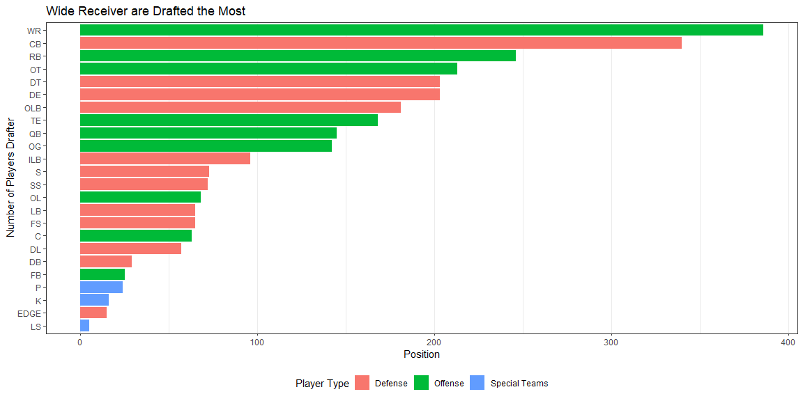
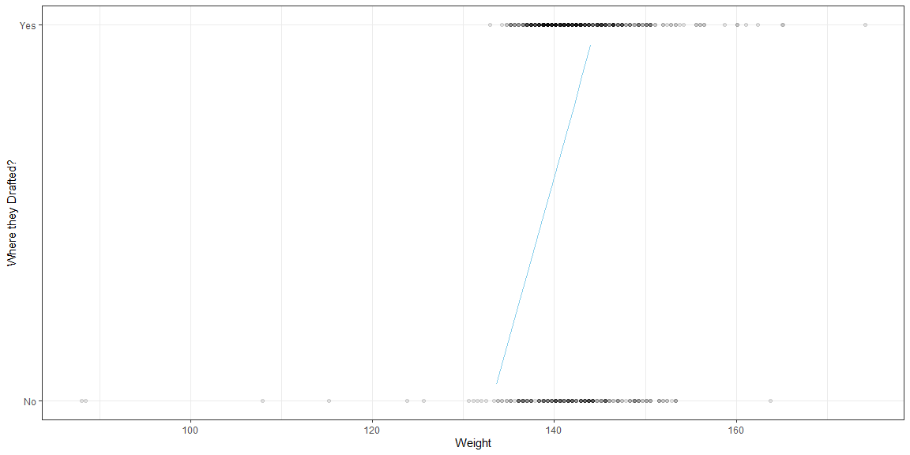

## Background

Use this week to finish your semester project. If you have been working on it all along then this should not be hard.


## Links to My Data

https://www.kaggle.com/datasets/redlineracer/nfl-combine-performance-data-2009-2019?resource=download
    
https://www.pro-football-reference.com/draft/2020-combine.htm
  
https://www.pro-football-reference.com/draft/2021-combine.htm  
    
https://www.pro-football-reference.com/draft/2022-combine.htm


## Loading in Data


```r
# Use this R-Chunk to import all your datasets!
combine_9_19 <- read_csv("~/Data Analyticts/Portfolio/Portfolio/Showcase Projects/NFL_combine/Data/NFL.csv")

combine_20 <- read_csv("~/Data Analyticts/Portfolio/Portfolio/Showcase Projects/NFL_combine/Data//2020_NFL_Combine_Data.csv")

combine_21 <- read_csv("~/Data Analyticts/Portfolio/Portfolio/Showcase Projects/NFL_combine/Data/2021_NFL_Combine_Data.csv")

combine_22 <- read_csv("~/Data Analyticts/Portfolio/Portfolio/Showcase Projects/NFL_combine/Data/2022_NFL_Combine_Data.csv")
```


## Data Wrangling


```r
# Use this R-Chunk to clean & wrangle your data!

# Adds the year that the combine was taking for each of the 3 seperate year datasets 
combine_20 <- combine_20 %>%
  mutate(Year = 2020)
  
combine_21 <- combine_21 %>%
  mutate(Year = 2021)

combine_22 <- combine_22 %>%
  mutate(Year = 2022)

#combines the 3 data sets that are the same format
combine_20_22 <- rbind(combine_20, combine_21, combine_22) 

#Gets the data set in the same format as the first one
combine_20_22_same <- combine_20_22 %>%
  mutate(Height = ((Feet * 12) + Inches)/39.37,
         Weight = Wt / 2.205,
         BMI = Weight / Height^2)%>%
  mutate(Drafted = ifelse(is.na(`Drafted (tm/rnd/yr)`), "No", "Yes"))%>%
  mutate(Player_Type = 
           case_when(Pos %in% c("C", "OG", "OT", "QB", "RB", "TE", "WR",
                                "FB", "OL") ~ "offense", 
                     Pos %in% c("CB", "DE", "DT", "EDGE", "LB", "S", "DL",
                                "OLB", "DB") ~ "defense",
                     Pos %in% c("K", "LS", "P") ~ "special_teams"))%>%
  select(Year, Player, School, Height, Weight, Sprint_40yd, Vertical,
         Bench, `Broad Jump`, Agility_3cone, Shuttle, 
         `Drafted (tm/rnd/yr)`, BMI, Player_Type, Pos, Drafted)%>%
  rename("Vertical_Jump" = Vertical, "Bench_Press_Reps" = Bench, 
         "Broad_Jump" = `Broad Jump`)

#Organizes the first data table so that it can be merged with the other ones
combine_9_19_same <- combine_9_19%>%
  separate(Player, into = c("Player", "Player_Code"), sep = "\\\\")%>%
  select(Year, Player, School, Height, Weight, Sprint_40yd, 
         Vertical_Jump, Bench_Press_Reps, Broad_Jump, Agility_3cone,
         Shuttle, Drafted..tm.rnd.yr., BMI, Player_Type, Position,
         Drafted)

#Combines are the data sets together
names(combine_20_22_same) <- names(combine_9_19_same) 

combine_same <- rbind(combine_9_19_same, combine_20_22_same)

#Wrangles the data set by making sure that there is one variable in each column
complete_combine <- combine_same%>%
  separate(Player, into = c("First_Name", "Last_Name"), sep = " ")%>%
  separate(Drafted..tm.rnd.yr., into = c("Draft_Team", "Round", "Pick",
           "Year1"), sep = "/")%>%
  separate(Round, into = c("Round", "Sufix"), sep = -3)%>%
  separate(Pick, into = c("Pick", "sufix1"), sep = -8)%>%
  select(Year, First_Name, Last_Name, School, Height, Weight, Sprint_40yd,
         Vertical_Jump, Bench_Press_Reps, Broad_Jump, Agility_3cone,
         Shuttle, Draft_Team, Round, Pick, BMI, Player_Type, Position,
         Drafted)

complete_combine_drafted <- complete_combine %>%
  filter(Drafted == "Yes")

complete_combine_oline <- complete_combine %>%
  filter(Position == "OT" | Position == "OG" | Position == "OL" | Position == "c")%>%
  mutate(drafted = if_else(Drafted == "Yes", 1, 0))
```


## Question 1 Which Position is more likely to be drafted

### Visualization


```r
# Use this R-Chunk to plot & visualize your data!
complete_combine_drafted %>%
  select(Position, Player_Type)%>%
  group_by(Player_Type, Position)%>%
  summarise(total = n())%>%
ggplot(aes(x = reorder(Position, total), y = total, fill = Player_Type))+
  geom_bar(stat = "identity")+
  theme_bw() +
  labs(title = "Wide Receiver are Drafted the Most",
       x = "Number of Players Drafter",
       y = "Position")+
  theme(panel.grid.major.y = element_blank(), 
        panel.grid.minor.y = element_blank(),
        legend.position = "bottom")+
  scale_fill_discrete(name = "Player Type", 
                       labels = c("Defense", "Offense", "Special Teams"))+
  coord_flip()
```

<!-- -->

### Conclusion

  From the graph above, the best position to play if you want to be drafted into the NFL is a wide receiver. The second is a corner back and the third is a running back. This makes sense as these positions are constantly switching out after plays so a team tends to have a lot of these three positions. 

## Question 2: What are the Most Important Factors for an Ofensive Linemen to Be Drafted

### Visualization


```r
best_glm <- glm(drafted ~  Weight+ Sprint_40yd+ Vertical_Jump+
               Bench_Press_Reps+ Agility_3cone,
               data = complete_combine_oline, family = binomial)

b <- best_glm$coefficients

b%>%
  knitr::kable(caption = "Coefficients")
```


Table: Coefficients

|                 |          x|
|:----------------|----------:|
|(Intercept)      | 15.4587759|
|Weight           |  0.0869169|
|Sprint_40yd      | -3.3447615|
|Vertical_Jump    |  0.0250494|
|Bench_Press_Reps |  0.0612908|
|Agility_3cone    | -1.5944615|

```r
all_gm_avg <- complete_combine_oline %>%
  summarise(Weight = round(mean(na.omit(Weight)), 4),
            "40yd Dash" = round(mean(na.omit(Sprint_40yd)), 2),
            "Vertical Jump" = round(mean(na.omit(Vertical_Jump)), 2),
            Bench = round(mean(na.omit(Bench_Press_Reps)), 1),
            Cone = round(mean(na.omit(Agility_3cone)), 2))

all_gm_avg %>%
  knitr::kable()
```


|   Weight| 40yd Dash| Vertical Jump| Bench| Cone|
|--------:|---------:|-------------:|-----:|----:|
| 142.2823|      5.24|         58.73|    25| 7.83|


```r
ggplot(data = complete_combine_oline, aes(x = Weight, y = drafted))+
  geom_point(alpha = .1)+
  stat_function(fun = function(x) b[1] + b[2]*x + b[3]*5.249 + b[4]*58.726 +
                                  b[5]*25 + b[6]*7.825, color="skyblue")+
  theme_bw()+
  scale_y_continuous(name = "Where they Drafted?",
                     labels = c("No", "Yes"),
                     breaks = seq(0, 1, 1),
                     limits = c(0,1))+
  theme(panel.grid.minor.y = element_blank())
```

<!-- -->


### Conclusion

  The model shown above is shows how much your odds will increase based on an increase of 1 for each of the those values. So for example, if you were to increase your bench press by 1, you increase your odds of getting drafted by 0.06. The graph above shows the line of best fit for the weight variable when all of the other factors are set to the average. As you can see their is sharp increase starting around 133kg and ending about 143kg. If you are an offensive linemen then you want to be above 143kg or 315lb to have the best shot of getting drafted.
  
  There are obviously other factors that this time of measurement does not take into account. This model was strictly based on data collected during the combine and does not factor in any stats that might have been gathered during a season. It also does not take into count skill level that can play a major role in deciding to draft someone or not. This analysis is simply designed to help add in the decision of what they should do to improve their chance of getting drafted. 
  

